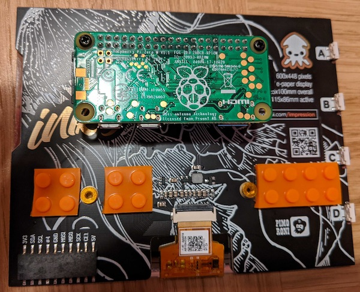
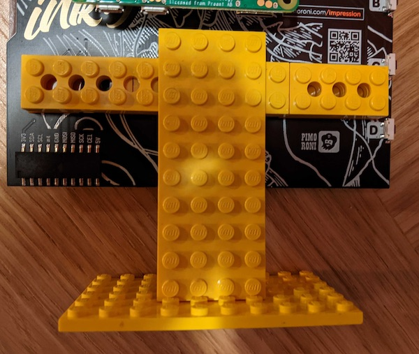

I got an [Inky Impression](https://shop.pimoroni.com/products/inky-impression) and after I got done [putting Silver Age comic panels on it](https://twitter.com/pikesley/status/1332313362953330691), I thought it might make a nice clock.

# Installing it

From a box-fresh install of Raspberry Pi OS Lite via [NOOBS 3.5](https://www.raspberrypi.org/documentation/installation/noobs.md):

## Enable SSH

Login on the Pi's console and

```bash
sudo raspi-config nonint do_ssh 0
```

You should now be able to get on to the Pi with

```bash
ssh pi@raspberrypi.local
```

## Install the software

You need `git`:

```bash
sudo apt-get install -y git
```

Then clone this repo:

```bash
git clone https://github.com/pikesley/impression-clock
```

and configure everything:

```bash
cd impression-clock
make setup
```

Optionally, change the hostname

```bash
sudo raspi-config nonint do_hostname impression
```

Now reboot, and the clock should start showing you the time

```bash
sudo reboot
```

# Hacking on it

There's a Docker image. Build it:

```bash
make build
```

and run it:

```bash
make run
```

Inside the container, the default `make` target will run the the linter and the tests:

```bash
make
```

# Design

Most of the easily-tweakable things are in `conf/conf.yaml`:

## Fonts

You can (independently) change the fonts for the `time` and `date` strings - download a TrueType font into `fonts` ([Google have some nice ones](https://fonts.google.com/)), then put its *exact* name (less the `.ttf` extension) in the `font.family` field. You can also set its point-size in the `size` field.

### `offset`

The `offset` is [the y-position of the text](https://pillow.readthedocs.io/en/stable/reference/ImageDraw.html#PIL.ImageDraw.ImageDraw.text) (I think), but I don't understand why different fonts require wildly different values to achieve a similar layout - I'm not sure _what_ it's offsetting, or what it's offsetting _from_. Maybe somebody who understands this stuff better than me might be able to explain what's going on.

As it is, I just tried various numbers until it looked OK. Which brings me to

## Testing the layout

There's a [special test](tests/font_size_test.py) which generates a sample clockface using `00:00` for the time and `22nd September` for the date (which, by my reckoning, are just about the widest strings the clock has to deal with), and drops it in `tmp/test-font-size.png`. This provides a handy guide as you're tweaking the `size` and `offset` values. And also

## Images

The clock generates the display using whatever is defined in `images.background` as its background image, and then `images.foreground` as a mask for the `time` and `date` strings (this basically means it fills in the text with the relevant parts of that image) - these images need to be 600x448 pixels, and placed in `backgrounds`.

By default, this gives black text on a white background, but you can put anything you want in there - using a photo for `background`, then a colour-inverted copy of that image for `text` works quite well.

I believe it may work nicely using whatever you might turn up with an image-search for `silver age x-men panel` but I cannot recommend doing this.

## Tests

Note that changing any of this stuff will cause the tests to fail - the expectations are sha256-hashes of the generated images. If you care, you should verify that the images generated at `tmp/clock.png` look correct, then copy the hashes from the test failures into the `checksums` dict in [tests/test_clockface.py](tests/test_clockface.py).

# Hardware

It's running on a Pi Zero W with a 15-minute load-average of about `0.17` - this is a very undemanding application.

## Making the stand

I attached some [Nimuno Loops / Makya Tape](https://www.thetoyshop.com/lego-construction/building-blocks/Mayka-Tape---2-Stud-Dark-Green-2-Metres-By-ZURU/p/532182_Dgreen) to the back of the screen:



And then made a stand out of Lego:


