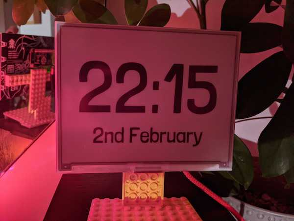

I got an [Inky Impression](https://shop.pimoroni.com/products/inky-impression) and after I got done [putting Silver Age comic panels on it](https://twitter.com/pikesley/status/1332313362953330691), I thought it might make a nice clock.

# Installing it

From a box-fresh install of Raspberry Pi OS Lite via [NOOBS 3.5](https://www.raspberrypi.org/documentation/installation/noobs.md):

## Enable SSH

Login on the Pi's console and

```bash
sudo raspi-config nonint do_ssh 0
```

You should now be able to get on to the Pi with

```bash
ssh pi@raspberrypi.local
```

## Install the software

You need `git`:

```bash
sudo apt-get install -y git
```

Then clone this repo:

```bash
git clone https://github.com/pikesley/impression-clock
```

and configure everything:

```bash
cd impression-clock
make setup
```

Optionally, change the hostname

```bash
sudo raspi-config nonint do_hostname impression
```

Now reboot, and the clock should start showing you the time

```bash
sudo reboot
```
